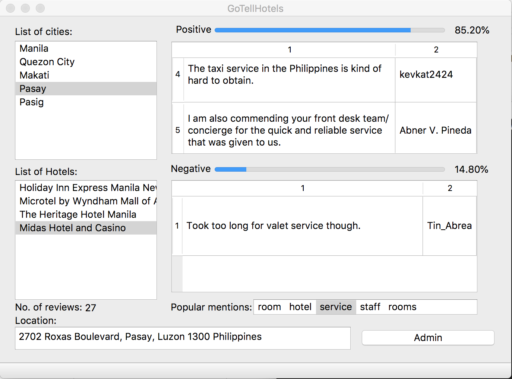
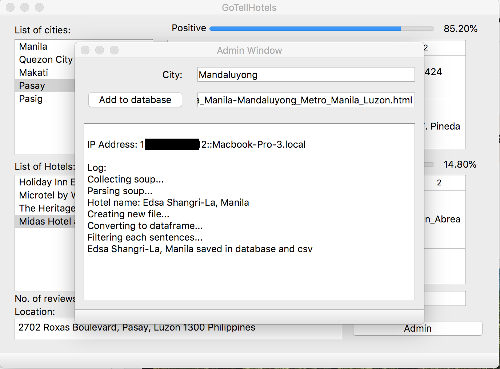

<h1>GoTellHotels</h1>
<h2>Description:</h2>

GoTellHotels is a python based application that uses webscrape machine learning and natural language processing to generate a human-understandable and browsable summary of the opinions expressed in a collection of TripAdvisor reviews about a particular hotel. GoTellHotel aims to summarize each review in terms of sentiments and aspects towards a hotel. For example, a user reviews a hotel with "...The rooms are nice and cozy.", GoTellHotel will use 'rooms' as a key term and determine the user's sentiment by using TextBlob's polarity (You can check TextBlob [here](https://tinyurl.com/y84hdx8b)).

GoTellHotels shows a sample list of cities in the Philippines so that each hotel can be classified in terms of their location. A list of hotels generates a table that consists of filtered snippets extracted from a review about a hotel. The label located below the list of hotels shows the total sentiments that has been extracted from the reviews, and below the label is the address of the hotel.  

The items in popular mentions are 'aspects' that GoTellHotels extracted from the reviews. These are the most commonly used words that reviewers mention when reviewing a certain hotel. When an aspect is selected, GoTellHotel displays the sentiments of reviewers towards that aspect. The two progress bar shows the overall number of positive and negative sentiments in terms of percentage. 

    

The left figure shows a login window for admins only. If a user successfuly login, the user can access the admin window (right figure) where they can add hotels within the domain of TripAdvisor. Adding hotels outside the domain of TripAdvisor will not work. GoTellHotels does not provide further modifications on the added hotels directly to the database, however, using DB Browser is possible for modification of added hotels within the existed databases.

<h2>Reference:</h2>

* Bing Liu's [Sentiment Analysis and Opinion Mining](https://www.cs.uic.edu/~liub/FBS/SentimentAnalysis-and-OpinionMining.pdf)(2012).
* Blair-Goldensohn et al.'s [Building a Sentiment Summarizer for Local Service Reviews](https://www.cs.uic.edu/~liub/FBS/sentiment-analysis.html) (2008) 
* Hu & Liu's [Mining and Summarizing Customer Reviews](https://www.cs.uic.edu/~liub/publications/kdd04-revSummary.pdf) (2004)
    
